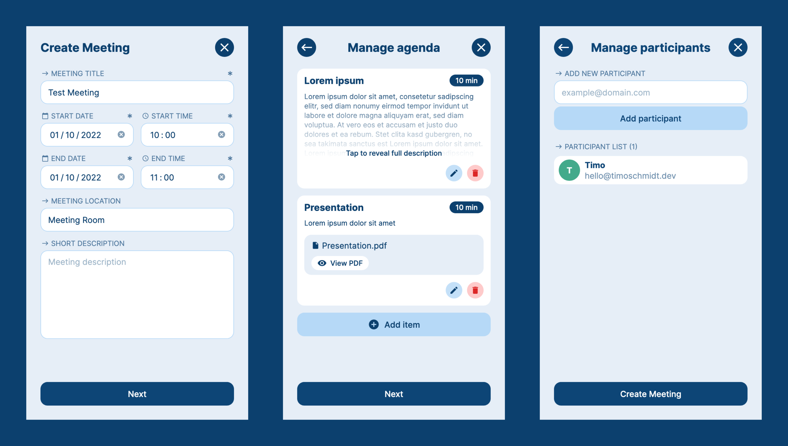

## Meeting Support App

An app to support face-to-face meetings with a range of features, such as

- Providing a meeting description in advance
- Collaborative agenda creation including PDF upload
- Timer to avoid lengthy meetings
- Alarm feature when the scheduled meeting duration is reached
- View and control agenda items and uploaded PDF documents
- Create private and shared notes
- Ask questions before and during a meeting
- Reports for completed meetings
- Feedback function for completed meetings

The app is primarily designed for use on mobile devices, but can also be used on other devices as it is responsive.

### Screenshots

### How to run it

#### Deployed version

A deployed version can be found on https://meeting-support-app.vercel.app.
To use the app, you must first register and confirm your email address.

#### Locally

[Please follow the instructions here](/lib/supabase/README.md)

---

### Credits

- Google Material Icons via [react-icons](https://react-icons.github.io/react-icons/icons?name=md)
