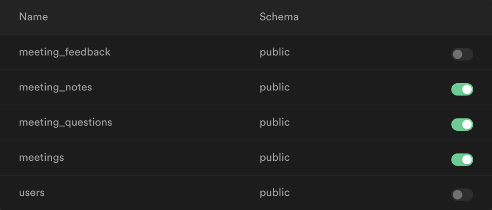

### Instructions to run app locally

#### Requirements

The app is using Supabase for the databases, authorization and storage. Therefore, a Supabase account is required. ([https://www.supabase.com](https://www.supabase.com))

#### Steps

1. Download or clone the repository

2. Install all dependencies by using `yarn install`
   or `npm install --save --legacy-peer-deps`

3. Sign in to your Supabase account and create a new project

4. Create a new `.env` file or use the [.example.env](../../.env.example) file and rename it accordingly

```
NEXT_PUBLIC_SUPABASE_URL=
NEXT_PUBLIC_SUPABASE_ANON_KEY=
NEXT_PUBLIC_SUPABASE_SERVICE_ROLE_KEY=
```

4. Open the project, copy the URL and API keys and paste them into the corresponding env variable [^1]

   _If you cannot find them, check **Settings** > **API**_

5. Open the **SQL Editor** from the sidebar

6. Copy the [SQL instructions](./tableSetup.sql) into the editor to create all databases by pressing **RUN**

7. Go to **Database** > **Replication** and activate the real-time feature for these 3 databases:

- meetings
- meeting_notes
- meeting_questions



8. Go to Storage and create a public bucket called **files**

   _If the storage is not working properly, it may be because you are missing permissions. [Try this to make it work](https://github.com/supabase/supabase/discussions/2466#discussioncomment-1307035)._

Everything is set up.

You can run the app now by using `npm run dev`.

[^1]: See also here: [https://supabase.com/docs/guides/with-nextjs#get-the-api-keys](https://supabase.com/docs/guides/with-nextjs#get-the-api-keys)
